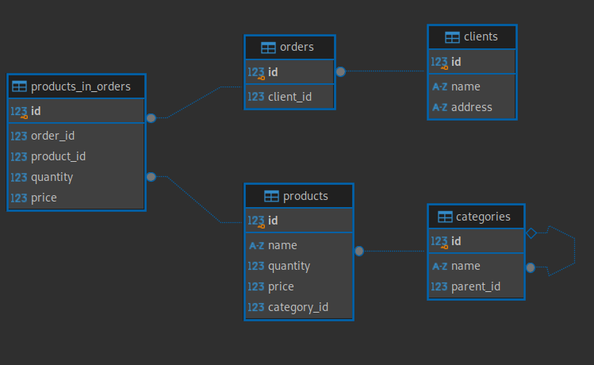

# Тестовое задание  

### Запуск проекта

```bash
git clone https://github.com/Bonik0/Aiti_Guru_Test.git
cd Aiti_Guru_Test
docker-compose up -d
```

### Даталогическая схема данных



В качестве метода хранения иерархии категорий был выбран метод Adjacency List, так как добавление новой категории или измение родительской категории не требует дополнительных действий в отличие от Closure Table или Materialized Path. Однако при таком подходе, чтобы получить полный список родительских категорий, необходимо выполнить рекурсивный запрос: 
```sql
WITH RECURSIVE category_tree AS (
    SELECT 
        id,
        name::TEXT AS path
    FROM categories 
    WHERE parent_id IS NULL
    
    UNION ALL
    
    SELECT 
        c.id,
        CONCAT(ct.path, '.', c.name) as path
    FROM categories c
    JOIN category_tree AS ct ON c.parent_id = ct.id
)
SELECT * FROM category_tree;
```

### Запросы

Получение информации о сумме товаров заказанных под каждого клиента
```sql
SELECT 
	c.name AS client_name,
    COALESCE(SUM(pio.quantity * pio.price), 0) AS total_amount
FROM clients c
LEFT JOIN orders AS o ON c.id = o.client_id 
LEFT JOIN products_in_orders AS pio ON pio.order_id = o.id
GROUP BY c.id
ORDER BY total_amount DESC;
```
Количество дочерних элементов первого уровня вложенности для категорий номенклатуры
```sql
SELECT 
    parent.name AS category_name,
    COUNT(child.id) AS child_count
FROM categories parent
LEFT JOIN categories AS child ON parent.id = child.parent_id
GROUP BY parent.id
ORDER BY parent.id;
```